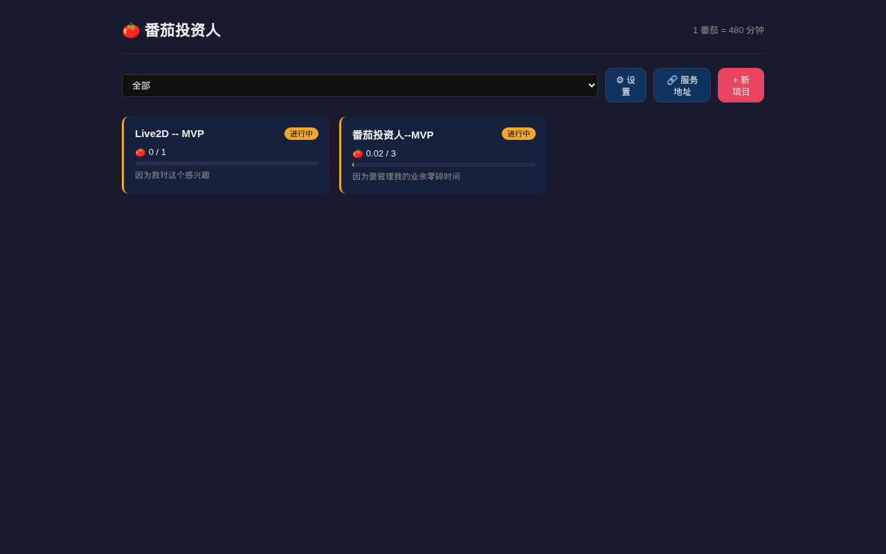
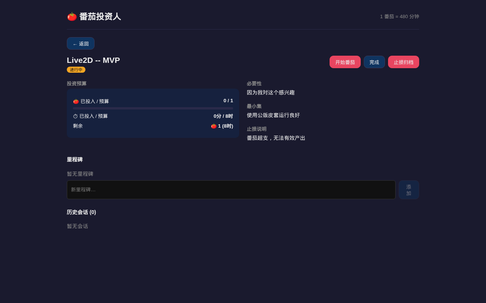

<div align="center">

# 🍅 番茄投资人

**用投资思维管理业余碎片化时间**

把**时间当资本**，用项目管理 + 投资逻辑（必要性、最小集、里程碑、止损、归档）驱动个人项目。

`Go 1.19 · React 19 · Vite · SQLite · Capacitor · GitHub Actions`

[](LICENSE)
[](https://github.com/wwtd/tomato-investor/actions/workflows/android-build.yml)

</div>

---

## 💡 核心概念

> 番茄不是传统 25 分钟番茄钟，而是一个**可分段的长会话投资单位**。

- **番茄**：抽象时间单位，默认 480 分钟（8h），**可全局或按项目配置**。
- **会话生命周期**：`START → [PAUSE+comment → RESUME]* → END`，可多次暂停并记录情景备注（文本/语音）。
- **自动折算**：结束时会话**自动按实际运行时长折算消耗**（`实际分钟 ÷ 番茄时长`，保留 2 位小数）。
- **投资预算**：项目设定"投资几个番茄"，追踪已投入 / 剩余。
- **止损归档**：预算用光但产出不及预期时，归档停损，避免沉没成本。

## 🚀 功能（MVP v0.2.0）

- 项目 CRUD + 必要性 / 最小集 / 止损说明 + 投资预算（番茄数）
- 番茄会话运行器：开始 / 暂停(带备注) / 恢复 / 文本备注 / 结束
- 语音备注（录音上传 + 手填文字）
- 里程碑管理：添加 / 完成 / 删除
- 投入统计：已投入 / 剩余番茄（小数）、分钟数
- 番茄时长配置（全局默认 480 分钟）
- **手机 APK**（Capacitor + GitHub CI 自动构建）
- **服务地址可配置**（APK 指向任意后端）

## 🖥️ 界面预览

| 项目列表 | 项目详情 |
|---------|---------|
|  |  |

## 🧰 技术栈

| 层 | 技术 |
|----|------|
| 后端 | Go 1.19 + chi v5 + SQLite（mattn/go-sqlite3, cgo） |
| 前端 | React 19 + Vite + TypeScript |
| 数据 | SQLite 单文件（`backend/data/tomato.db`） |
| 移动端 | Capacitor 8（Android） |
| CI | GitHub Actions（自动出 Android Debug APK） |
| 部署 | 本地自托管 / 局域网 / Tailscale |

## ⚡ 快速开始

**前置**：Go 1.19+、Node 18+、pnpm、gcc（cgo 需要）。

### 一键启动 / 停止（推荐）
```bash
./start.sh   # 构建后端 → 后台启动后端(:7800) + 前端(:5173)，就绪后打印访问地址
./stop.sh    # 一键停止前后端
```
- 日志与 PID 在 `logs/`（backend.log / frontend.log），已加入 .gitignore。
- 后端有源码改动会自动重新构建；首次运行自动 `pnpm install`。

### 手动启动（两个终端）
```bash
# 后端
cd backend
go run . -addr :7800   # 默认 0.0.0.0:7800，数据在 backend/data/tomato.db

# 前端
cd frontend
pnpm install && pnpm dev   # http://localhost:5173，自动代理 /api 到后端
```

### 其他设备访问
后端绑 `0.0.0.0:7800`（显式 IPv4），前端绑 `0.0.0.0:5173`。局域网内访问：
```
http://<本机局域网IP>:5173    # 前端
http://<本机局域网IP>:7800    # 后端 API
```

> ⚠️ 后端必须用 `0.0.0.0:7800`（非 `:7800`）。Go 的 `:port` 绑 IPv6-only 双栈，安卓等客户端连不上。
> ⚠️ 录音需安全上下文（HTTPS 或 localhost）；局域网 IP 访问录音不可用，需 HTTPS/Tailscale。

## 📱 Android APK

前端用 **Capacitor** 打包为原生安卓壳。**APK 由 GitHub Actions 自动构建**，本机无需 Android SDK/JDK。

### 自动出包
推送 `main`（或 `workflow_dispatch`）即触发：`pnpm install → pnpm build → cap sync → gradlew assembleDebug`，产出有编号的 **debug APK**（`tomato-investor-v0.2.0-run{N}.apk`）。

在仓库 **Actions** 页下载对应 run 的 artifact。

### APK 服务地址
APK 内 API 地址**不写死**，启动读取 `localStorage` 的 `server_url`：
- 已配置 → 用该地址（拼 `/api`）
- 未配置 → Web 用相对 `/api`（走代理）；native 默认 `http://192.168.31.102:7800`

App 首页 **「🔗 服务地址」** 可设置 + 测试连接。

> ⚠️ 已启用 `plugins.CapacitorHttp.enabled=true`：APK 内 fetch 走原生网络栈，绕开 WebView 对我局网 http 明文 + 跨源的限制。改代码后 `npx cap sync android`。

## 📖 API 概览

前缀 `/api`，REST/JSON。

| 方法 | 路径 | 说明 |
|------|------|------|
| GET / POST | `/projects` | 列 / 建项目 |
| GET / PUT / DELETE | `/projects/{id}` | 项目 CRUD |
| PATCH | `/projects/{id}/status` | 完成 / 止损归档 |
| GET | `/projects/{id}/stats` | 投入统计 |
| POST | `/projects/{id}/milestones` | 添加里程碑 |
| PATCH / DELETE | `/milestones/{id}` | 改 / 删里程碑 |
| POST | `/projects/{id}/sessions` | 开始会话 |
| GET | `/sessions/{id}` | 会话详情（含事件流） |
| POST | `/sessions/{id}/pause` | 暂停（可带备注） |
| POST | `/sessions/{id}/resume` | 恢复 |
| POST | `/sessions/{id}/comment` | 文本备注 |
| POST | `/sessions/{id}/voice` | 语音上传（multipart） |
| POST | `/sessions/{id}/end` | 结束（自动折算） |
| GET / PUT | `/settings` | 番茄时长配置 |
| GET | `/voice/{filename}` | 语音文件 |

## 📂 目录结构

```
tomato-dir/
  backend/                Go 后端（chi + sqlite）
    db/                    schema + db 层
    model/                 类型
    api/                   REST handlers
  frontend/                React + Vite + TS
    android/               Capacitor Android 工程
    src/api.ts             API 客户端（含服务地址配置）
    src/components/        列表/详情/会话/里程碑组件
  docs/
    DESIGN.md              设计规格 + 数据模型
    PROGRESS.md            开发进展记录
    RUN.md                 详细运行说明
```

## 🗃️ 数据模型要点

- `projects`：标题、必要性、最小集、止损说明、预算番茄数、番茄时长覆盖、状态
- `sessions`：番茄会话，`consumed_tomato`(REAL) 存按实际运行时长折算的小数消耗
- `session_events`：事件流（pause/resume/comment/voice_note），重建运行时长（暂停不计时）
- `voice_notes`：语音备注文件 + 手填文字
- 单用户，预留 `owner_id`，可扩多用户

## 🛠️ 构建

```bash
# 后端
cd backend && go build -o tomato-server .

# 前端
cd frontend && pnpm build && npx cap sync android
```

## 🧭 后续规划（非 MVP）

- [ ] STT 语音转写
- [ ] 任务链并行视图
- [ ] 多端同步
- [ ] 多用户

## License

[MIT](LICENSE) © 2026 wwtd
